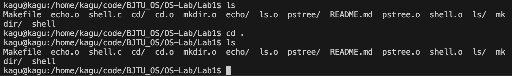
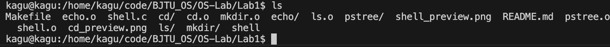
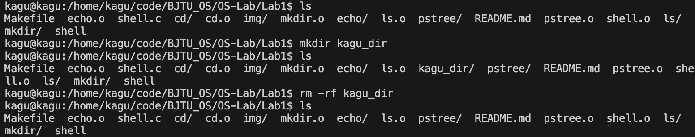
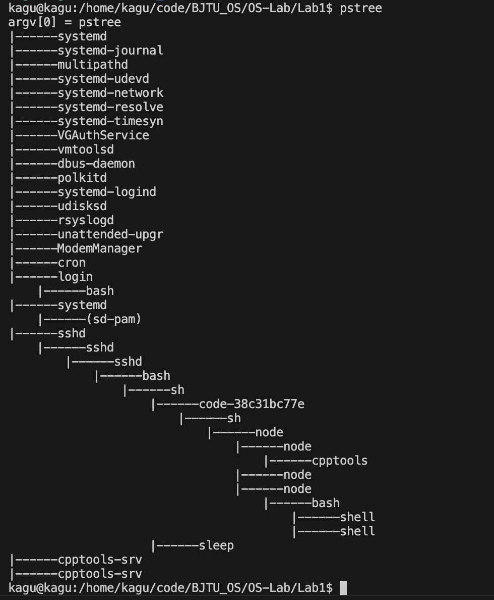
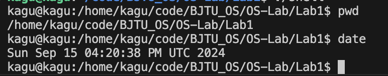
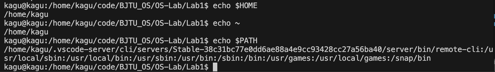

**使用方法**

1. 执行编译连接
    
    make
2. 运行shell
    
    ./shell

**预览效果**

**内置命令**

* cd

如果只输入'cd',那么将返回$HOME路径。

* ls

* echo

* mkdir

* pstree

pstree是一个简易版的实现，距离真实shell端的pstree还有一定区别，但是可以实现具体功能

**外部命令**

所有外部命令都可以直接调用，包括带参数

**环境变量支持**

支持所有环境变量的解析
